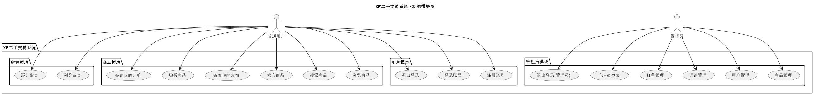

# 学校二手市场交易系统  
项目汇报  

演示人：庞晓宇  
日期：2025年6月25日  

---

## 项目背景与意义

- 高校学生更替频繁，闲置物品资源浪费严重  
- 校内交易渠道分散、效率低下  
- 建立一个校内可信任的二手交易系统  
- 推动资源循环利用与环保意识  

---

## 项目目标与技术路线

**项目目标：**
- 开发一套基于 C 语言的命令行交易系统  
- 支持用户与管理员的完整交易流程  

**技术路线：**
- C语言实现控制台界面  
- CSV或结构体文件持久化数据存储  
- 使用模块化函数与结构体组织代码逻辑  

---

## 系统用户与权限划分

**普通用户（学生）：**
- 注册、登录  
- 浏览/发布/购买商品  
- 查看自己的发布和购买记录  
- 评论商品  

**管理员：**
- 管理所有商品  
- 管理注册用户  
- 管理评论与订单  

---

## 功能模块图



- 用户模块  
- 商品模块  
- 评论模块  
- 订单模块  
- 管理员模块  

---

## 核心功能演示 - 用户端

- **注册/登录**：用户名唯一，密码隐藏输入  
- **商品发布**：输入名称、价格、描述  
- **商品列表**：浏览商品、进入详情页  
- **我的发布/我的购买**：查看和管理记录  
- **评论功能**：可对商品留言  

---

## 核心功能演示 - 管理员端

- **商品管理**：查看/删除任意商品  
- **用户管理**：删除用户、设置管理员  
- **评论管理**：查看/删除所有评论  
- **订单管理**：查看/删除交易记录  

---

## 数据结构设计（节选）

```c
typedef struct {
    int userID;
    char username[20];
    char password[20];
    int isAdmin;
} User;

typedef struct {
    int productID;
    int ownerID;
    char name[50];
    char description[200];
    float price;
    int isSold;
} Product;
```

> 其余结构包括 Order、Message 等，详见项目源码

---

## 系统运行流程图

```
[启动系统]
      ↓
[主菜单：注册/登录]
      ↓
[判断身份：普通用户 / 管理员]
      ↓
[对应功能菜单]
      ↓
[发布/浏览/管理商品、订单、评论等]
      ↓
[退出登录 / 退出系统]
```

---

## 项目演示

见演示视频

---

## 总结与展望

**总结：**
- 实现了基本的学校二手交易流程  
- 控制台操作流畅，结构清晰  
- 具备较强的可扩展性  

**展望：**
- 增加评论点赞、回复功能  
- 商品分类、关键词搜索  
- 计划开发图形界面或网页版本  
