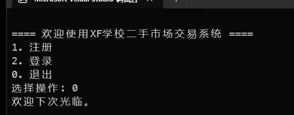

# 学校二手市场交易系统 - 作品文档

## （一）需求分析文档

### 1. 目标用户
1. 高校在校学生（普通用户）
2. 系统管理员（教师或学生干部）

### 2. 使用场景
1. 学生毕业转让旧物
2. 新生低价购买学习生活用品
3. 校园内部二手交易促进资源循环

### 3. 功能需求

#### 普通用户
- 账户注册与登录
- 浏览商品列表
- 发布商品（含描述、价格）
- 购买商品
- 查看个人发布与购买记录
- 退出登录

#### 管理员
- 登录管理账户
- 管理商品信息
- 管理用户账号
- 管理评论内容
- 管理订单信息
- 退出登录


## （二）概要设计

### 1. 功能模块图


### 2. 用户用例图
普通用户用例：
```
注册 → 登录 → 浏览商品 → 购买 / 发布商品 → 查看我的发布/购买 → 退出登录
```

管理员用例：
```
登录 → 管理商品 / 用户 / 评论 / 订单 → 退出登录
```


## （三）详细设计

### 1. 主要函数说明
#### 一、用户相关函数（User）
int addUser(User u);
- 功能：添加新用户到用户列表。
  - 参数：
    - u：用户结构体，包含用户名、密码等信息。
  - 返回值：添加成功返回 1，失败返回 0。

int deleteUserByID(int userID);
- 功能：根据用户ID删除用户。
- 参数：userID：待删除用户的ID。
- 返回值：成功返回 1，失败返回 0。

User *findUserByID(int userID);
- 功能：通过用户ID查找用户。
- 返回值：找到则返回指向用户的指针，否则返回 NULL。

User *findUserByUsername(char *username);
- 功能：通过用户名查找用户。
- 返回值：找到则返回指针，否则返回 NULL。

UserList *getUserList();
- 功能：获取当前所有用户列表。
- 返回值：指向用户列表的指针。

#### 二、商品相关函数（Product）
int addProduct(Product p);
- 功能：添加商品。
- 返回值：成功返回 1，失败返回 0。

int deleteProductByID(int productID);
- 功能：删除指定 ID 的商品。
- 返回值：成功返回 1，失败返回 0。

Product *findProductByID(int productID);
- 功能：根据商品ID查找商品。
- 返回值：找到返回指针，否则返回 NULL。

ProductList *getProductList();
- 功能：获取全部商品列表。
- 返回值：商品列表指针。

ProductList *getOnSaleProductList();
- 功能：获取所有在售商品。
- 返回值：在售商品列表指针。

ProductList *getMyPublishProductList(int userID);
- 功能：获取用户发布的商品。
- 参数：userID：用户ID。
- 返回值：该用户发布商品列表。

#### 三、评论相关函数（Message）
int addMessage(Message m);
- 功能：添加评论。
- 返回值：成功返回 1，失败返回 0。

int deleteMessageByID(int messageID);
- 功能：删除指定评论。
- 返回值：成功返回 1，失败返回 0。

MessageList *getMessageList();
- 功能：获取全部评论。
- 返回值：评论列表。

MessageList *findMessageByProductID(int productID);
- 功能：根据商品ID获取相关评论。
- 返回值：该商品对应的评论列表。

#### 四、订单相关函数（Order）
int addOrder(Order o);
- 功能：添加订单。
- 返回值：成功返回 1，失败返回 0。

int deleteOrderByID(int orderID);
- 功能：根据ID删除订单。
- 返回值：成功返回 1，失败返回 0。

OrderList *getOrderList();
- 功能：获取全部订单。
- 返回值：订单列表指针。

OrderList *getMyPurchaseList(int userID);
- 功能：获取用户的购买记录。
- 参数：userID：用户ID。
- 返回值：用户订单列表。

#### 五、系统初始化与销毁
int initStore();
- 功能：初始化数据结构并加载文件数据。
- 返回值：成功返回 1。

int destroyStore();
- 功能：保存数据并释放内存。
- 返回值：成功返回 1。

#### 六、菜单与交互函数（menu.c）
void mainMenu();
- 功能：主菜单，包括注册、登录。

void registerUser();
- 功能：注册新用户。

void loginUser();
- 功能：登录并跳转到用户/管理员菜单。

void userMenu();
- 功能：普通用户功能菜单（商品浏览、发布等）。

void adminMenu();
- 功能：管理员菜单（管理商品、用户、订单等）。

void publishProduct();
- 功能：发布新商品。

void showProductList();
- 功能：显示所有在售商品。

void myPublish();
- 功能：查看用户自己发布的商品。

void myPurchase();
- 功能：查看用户购买的商品订单。

void productManagement();
- 功能：管理员查看和管理所有商品。

void orderManagement();
- 功能：管理员查看和管理订单。

void userManagement();
- 功能：管理员查看和管理用户信息。

void messageManagement();
- 功能：管理员查看和管理评论。

void productDetail(Product *product);
- 功能：查看商品详情并可购买、评论。

void orderDetail(Order *order);
- 功能：查看订单详情并可删除。

void userDetail(User *user);
- 功能：查看用户信息，可删除或设为管理员。

void messageDetail(Message *message);
- 功能：查看评论详情并可删除。


## （四）作品实现

### 1. 编码环境
- 开发语言：C语言
- 编译环境：Visual Studio
- 操作系统：Windows 11

### 2. 主要界面截图（部分）
主界面


注册界面


登陆界面


用户菜单


发布商品


查看发布


发布详情


商品列表


商品详情 & 评论


购买确认


订单查看


订单详情


管理员登录


管理员菜单


商品管理


用户管理


评论管理


订单管理


退出系统



## （五）作品测试

### 1. 测试内容
| 测试用例               | 预期结果         | 实际结果 | 通过情况 |
| ---------------------- | ---------------- | -------- | -------- |
| 用户注册重复用户名     | 报错提示         | 报错提示 | ✔️        |
| 用户登录错误密码       | 拒绝登录         | 拒绝登录 | ✔️        |
| 发布商品后是否可见     | 商品列表可见     | 可见     | ✔️        |
| 商品购买后是否设为已售 | 状态更新为“已售” | 正确     | ✔️        |
| 管理员删除用户         | 用户被移除       | 正确     | ✔️        |

### 2. 测试结论
系统主要功能稳定，能够满足大部分场景需求

极端情况如同时发布与购买未完全测试，建议后期补充压力测试


## （六）任务分配与开发过程记录

### 1. 任务分配表
| 组员 | 任务 | 状态   |
| ---- | ---- | ------ |
| ?    | ??   | 已完成 |
| ?    | ??   | 已完成 |
| ?    | ??   | 已完成 |
| ?    | ??   | 已完成 |
| ?    | ??   | 已完成 |

### 2. 过程记录（节选）

### 第一次讨论（6月18日）
- 确定使用C语言命令行程序
- 讨论功能范围（用户 vs 管理员）
- 拆分模块任务分配

### 第二次会议（6月22日）
- 展示各自已完成部分
- 讨论数据结构和存储机制
- 商定统一交互风格

### 第三次会议（6月24日）
- 整合代码，修复冲突
- 完成用户手册与文档
- 开展初步测试


## （七）附录
会议截图.jpg
开发代码合照.jpg
