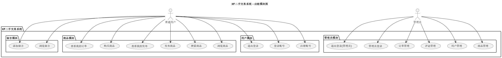

# 学校二手市场交易系统

## 需求分析

### 1 项目背景
随着高校学生更替频繁，许多学生毕业后会留下书籍、生活用品、电子设备等物品。建立一个简洁高效的二手交易系统，便于学生在校内进行二手物品买卖，有助于资源循环利用。

### 2 项目目标
开发一个基于 C语言 的命令行控制台二手交易系统，支持用户注册登录、发布/浏览/搜索商品、购买商品和留言功能。

### 3 系统用户
- 普通用户（学生）
- 管理员

### 4 功能需求

#### 用户功能
- 注册新账号（用户名不能重复）
- 登录账号
- 商品列表
- 发布商品（名称、描述、价格）
- 我的发布
- 我的购买
- 退出登录

#### 管理员功能
- 登录管理员账户
- 商品管理
- 用户管理
- 评论管理
- 订单管理
- 退出登录


## 功能模块图



## 数据结构设计
```c
typedef struct
{
    int userID;
    char username[20];
    char password[20];
    int isAdmin; // 0:普通用户 1:管理员
} User;

typedef struct
{
    int productID;
    int ownerID; // 对应用户ID
    char name[50];
    char description[200];
    float price;
    int createTime;
    int isSold; // 0:未售 1:已售
} Product;

typedef struct
{
    int messageID;
    int userID;
    int productID;
    char message[200];
    int createTime;
} Message;

typedef struct
{
    int orderID;
    int userID;

    int productID;
    int ownerID;           // 商品信息
    char name[50];         // 商品信息
    char description[200]; // 商品信息
    float price;           // 商品信息
    int createTime;
} Order;
```


## 界面设计（部分）

### 主界面
```
==== 欢迎使用XF学校二手市场交易系统 ====
1. 注册
2. 登录
0. 退出
选择操作:
```

注册
```
XF学校二手市场交易系统 -- 注册
输入用户名: txyz
输入密码: 123456
```

登录
```
XF学校二手市场交易系统 -- 登录
输入用户名: txyz
输入密码: ******
```

退出
```
==== 欢迎使用XF学校二手市场交易系统 ====
1. 注册
2. 登录
0. 退出
选择操作:
0
欢迎下次光临。
```

### 管理员菜单
```
XF学校二手市场交易系统 -- 管理员菜单
1. 商品管理
2. 用户管理
3. 评论管理
4. 订单管理
0. 退出登录
```

商品管理

用户管理

评论管理

订单管理


### 用户菜单
```
XF学校二手市场交易系统 -- 管理员菜单
1. 商品列表
2. 发布商品
3. 我的发布
4. 我的购买
0. 退出登录
```

商品列表

发布商品

我的发布

我的购买

退出登录


## 用户手册

### 一、系统介绍
本系统是一个基于控制台界面的学校二手交易系统，供学生用户发布和购买商品，管理员进行信息管理。系统功能分为两类：
- **普通用户功能**：注册、登录、浏览商品、发布商品、购买商品、查看自己的发布和订单。
- **管理员功能**：管理所有商品、用户、订单和评论。


### 二、系统使用流程

#### 1. 启动系统
运行程序后将显示主菜单：

```
==== 欢迎使用XF学校二手市场交易系统 ====
1. 注册
2. 登录
0. 退出
```

#### 2. 注册流程
选择 `1. 注册` 后：
- 输入用户名（若重复将要求重新输入）
- 输入密码（明文输入）

成功后返回主菜单。

#### 3. 登录流程
选择 `2. 登录` 后：
- 输入用户名（若不存在将重复提示）
- 输入密码（隐藏输入）

验证通过后：
- 若为普通用户，进入【用户菜单】
- 若为管理员，进入【管理员菜单】


### 三、功能详解

#### 1. 用户菜单功能（普通用户登录后）
```
XF学校二手市场交易系统 -- 用户菜单
1. 商品列表
2. 发布商品
3. 我的发布
4. 我的购买
0. 退出登录
```

##### 【1】商品列表
- 查看所有在售商品
- 输入商品ID查看详情
    - 可选择：购买商品、（未来支持评论）  

##### 【2】发布商品
- 输入商品名、价格、描述，即可发布

##### 【3】我的发布
- 查看自己发布的所有商品
- 可进入详情页查看状态

##### 【4】我的购买
- 查看自己购买的订单列表
- 可选择删除订单


#### 2. 管理员菜单功能（管理员登录后）
```
XF学校二手市场交易系统 -- 管理员菜单
1. 商品管理
2. 用户管理
3. 评论管理
4. 订单管理
0. 退出登录
```

##### 【1】商品管理
- 查看所有商品
- 可进入详情页，查看商品状态和发布者

##### 【2】用户管理
- 查看所有注册用户
- 进入用户详情页可执行：
    - 删除用户
    - 设为管理员

##### 【3】评论管理
- 查看所有商品评论（评论功能开发中）
- 可删除评论

##### 【4】订单管理
- 查看所有交易订单
- 可删除订单

### 四、注意事项
- 商品一经购买即标记为“已售”
- 删除操作需手动确认
- 密码输入时支持隐藏输入与退格修改
- 管理员权限可以通过用户管理模块赋予

### 五、常见问题
- **Q：注册失败？**  
    A：可能是用户名重复，重新输入新用户名即可。
- **Q：无法登录？**  
    A：请确认用户名存在、密码正确。
- **Q：商品购买失败？**  
    A：商品可能已被购买，请刷新商品列表。


如需进一步维护建议或功能拓展，可联系系统开发团队。该系统适用于课程设计、项目实践等学术场景。
