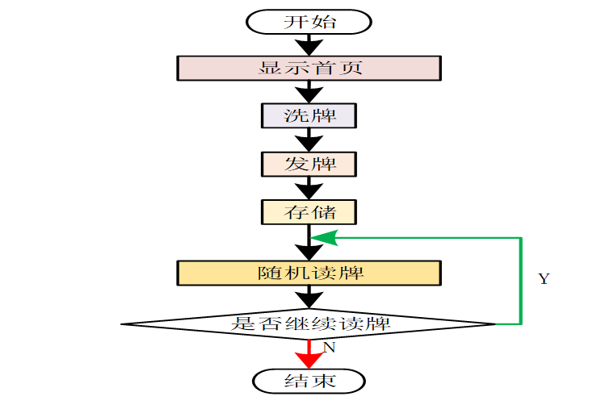

## 概述
该程序模拟了一个简单的纸牌发牌系统，包括洗牌、发牌、存储和读取牌组的功能。程序主要通过控制台进行交互，并使用文件系统来持久化存储牌组数据。

## 流程图


## 头文件说明
```c
#include <stdio.h>   //包含标准输入输出库 ；
#include <stdlib.h>  //包含标准库函数 ；
#include <time.h>    //包含日期和时间的头文件，用于需要时间方面的函数 ；
#include <windows.h> //包含定义了关于创建窗口，消息循环等函数，如果要用API来做有界面的程序的话，必须要用到这个头文件；
```

## 结构体定义
```c
typedef struct card
{
    const char *number; // 定义字符型指针变量number ；
    const char *color;  // 定义字符型指针变量color ；
} Card;
```

## 函数声明
```c
// 声明将字符串放入Card结构体的函数
void FillDeck(Card *wDeck, const char *wNumber[], const char *wColor[]);
// 声明洗牌的函数
void Shuffle(Card *wDeck);
// 声明发牌的函数
void Deal(Card *wDeck);
// 声明写入文件的函数
void Write_File(Card *wDeck);
// 声明读出文件的函数
void Read_File();
// 声明打印函数
void Print();
void park();
```

## 主函数
```c
int main()
{
    Print();                                                                                   // 打印首页面
    Card deck[52];                                                                             // 定义Card型数组deck[]，用于存储52张牌；
    const char *number[] = {"A", "2", "3", "4", "5", "6", "7", "8", "9", "10", "J", "Q", "K"}; // 指针数组的初始化，表示13张牌
    // const char *color[] = {"3", "4", "5", "6"};                                                // 指针数组的初始化，表示不同花色；
    const char *color[] = {"♥", "♦", "♣", "♠"}; // 指针数组的初始化，表示不同花色；

    FillDeck(deck, number, color); // 将字符串放入Card结构体
    Shuffle(deck);                 // 洗牌
    Deal(deck);                    // 发牌
    Write_File(deck);              // 写入文件
    Read_File();                   // 读出文件
    return 0;
}
```

## 欢迎页
```c
void Print() // 打印首页面
{
    printf("\t_________________系统正在加载中，请稍等_____________________\t\n\n");
    for (int i = 0; i < 20; i++)
    {
        printf(".....");
        Sleep(20); // 延时打印 ；
    }
    system("CLS");      // 清屏 ；
    system("color 5F"); // 颜色属性由两个十六进制数字指定 ， 5 = 紫色（背景色） F = 亮白色（前景色）；

    printf("    **********************************************************************\n");
    Sleep(10);
    printf("    * A%c      *   |   * A%c      *   |   * A%c      *   |   * A%c      *\n", 3, 4, 5, 6); // 按照ASCII码表,十进制的3，用字符表示一个桃心；
    Sleep(20);
    printf("    *         *   |   *         *   |   *         *   |   *         *\n");
    printf("    *         *   |   *         *   |   *         *   |   *         *\n");
    Sleep(25);
    printf("    *         *   |   *         *   |   *         *   |   *         *\n");
    Sleep(10);
    printf("    *         *   |   *         *   |   *         *   |   *         *\n");
    printf("    *       A%c*   |   *       A%c*   |   *       A%c*   |   *       A%c*\n", 3, 4, 5, 6);
    Sleep(10);
    printf("    **********************************************************************\n");
    Sleep(10);
    printf("    ********************************模拟发牌******************************\n");
    printf("\n");
    printf("\n");
    printf("\n");
}
```

## 初始化卡牌
```c
void FillDeck(Card *wDeck, const char *wNumber[], const char *wColor[])
{
    for (int i = 0; i < 52; i++)
    {
        wDeck[i].number = wNumber[i % 13];
        wDeck[i].color = wColor[i / 13];
    }
}
```

## 洗牌
```c
void Shuffle(Card *wDeck)
{
    for (int i = 0; i < 52; i++)
    {
        int j = rand() % 52;
        Card temp = wDeck[i];
        wDeck[i] = wDeck[j];
        wDeck[j] = temp;
    }
}
```

## 发牌
```c
void Deal(Card *wDeck)
{
    for (int i = 0; i < 52; i++)
    {
        switch (i)
        {
        case 0:
            printf("\n第一副牌: ");
            break;
        case 13:
            printf("\n第二副牌: ");
            break;
        case 26:
            printf("\n第三副牌: ");
            break;
        case 39:
            printf("\n第四副牌: ");
            break;
        }
        printf("%s%s\t", wDeck[i].color, wDeck[i].number);
    }
}
```

## 写入文件
```c
void Write_File(Card *wDeck)
{

    FILE *fp = NULL;              // 定义一个文件指针
    fp = fopen("data.dat", "wb"); // 写入一个dat文件，二进制文件
    if (fp == NULL)               // 判断是否可以打开
    {
        printf("error!");
        return;
    }

    // 写入文件
    for (int i = 0; i < 52; i++)
    {
        fwrite(&wDeck[i], sizeof(Card), 1, fp);
    }
    fclose(fp); // 关闭文件

    printf("\n\n=================================存 储 成 功 !=================================\n\n\n");
}
```

## 读出文件
```c
void Read_File()
{
    char reply; // 定义一个字符变量用来表示是否继续游戏;
    int i, a;   // 定义局部变量i(变量循环),a(选项);

    do
    {
        Card wDeck[52];
        Card *pointer;   // 定义一个 Card型的指针pointer；
        pointer = wDeck; // 让 pointer指向 wDeck；

        FILE *fp = NULL;              // 定义文件指针；
        fp = fopen("data.dat", "rb"); // 打开文件，默认地址是执行文件下 ；
        if (fp == NULL)
        {
            printf("error!");
            return;
        }

        // 读取文件
        for (int i = 0; i < 52; i++)
        {
            fread(&wDeck[i], sizeof(Card), 1, fp);
        }
        fclose(fp); // 关闭指针；
        printf("\n");
        printf("请问您想看第几副牌（1--4）：");
        scanf("%d", &a);
        getchar();
        // 根据a的值输出牌面信息
        int offset = 0;
        switch (a)
        {
        case 1:
            printf("第一副牌: ");
            offset = 0;
            break;
        case 2:
            printf("第二副牌: ");
            offset = 13;
            break;
        case 3:
            printf("第三副牌: ");
            offset = 26;
            break;
        case 4:
            printf("第四副牌: ");
            offset = 39;
            break;
        default:
            printf("意料之外的输入，将展示第一副牌: ");
        }
        for (int i = 0; i < 13; i++)
        {
            int index = offset + i;
            printf("%s%s\t", wDeck[index].color, wDeck[index].number);
        }
        printf("\n\n");
        printf("是否继续(输入 Y/y 以继续)：");
        scanf("%c", &reply);
    } while (reply == 'Y' || reply == 'y'); // 当输入y继续循环
}
```

## “华丽”的洗牌
```c
void park()
{

    int i, a = 0;
    printf("        华丽丽的洗牌中!       \n");
    while (a < 15) // 循环15次
    {
        // 每个for循环代表每个颜色持续的时间
        for (i = 0; i < 9; i++)
            ;
        system("color a"); // A = 淡绿色
        for (i = 0; i < 9; i++)
            ;
        system("color b"); // B = 淡浅绿色
        for (i = 0; i < 9; i++)
            ;
        system("color c"); // C = 淡红色
        for (i = 0; i < 9; i++)
            ;
        system("color d"); // D = 淡紫色
        for (i = 0; i < 9; i++)
            ;
        system("color e"); // E = 淡黄色
        for (i = 0; i < 9; i++)
            ;
        system("color f"); // F = 亮白
        a++;
    }
    printf("\n\n\n        洗牌结束!        \n\n");
}
```

