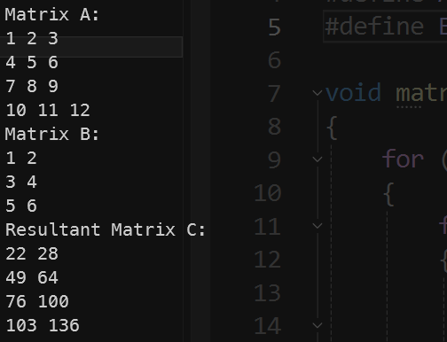
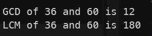
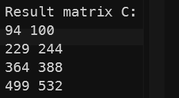

实验报告
---

### 一、实验目的
1. 掌握矩阵乘法的基本原理和编程实现。
2. 理解并实现求两个整数的最大公约数和最小公倍数的算法。
3. 编写通用的二维数组矩阵乘法函数，并进行调用和验证。


### 二、实验内容与步骤

#### 1. 矩阵乘法（A4x3 与 A3x2）
算法设计：
1. 定义两个矩阵 A (4x3) 和 B (3x2)。
2. 初始化结果矩阵 C (4x2)，所有元素初始为0。
3. 使用三重循环进行矩阵乘法计算：
   1. 外层循环遍历结果矩阵的每一行。
   2. 中层循环遍历结果矩阵的每一列。
   3. 内层循环进行对应元素的相乘和累加。

C语言代码：
```c
#include <stdio.h>

#define A_ROWS 4
#define A_COLS 3
#define B_COLS 2

void matrixMultiply(int A[A_ROWS][A_COLS], int B[A_COLS][B_COLS], int C[A_ROWS][B_COLS]) {
    for (int i = 0; i < A_ROWS; i++) {
        for (int j = 0; j < B_COLS; j++) {
            C[i][j] = 0;
            for (int k = 0; k < A_COLS; k++) {
                C[i][j] += A[i][k] * B[k][j];
            }
        }
    }
}

int main(int argc, char *argv[]) {
    int A[A_ROWS][A_COLS] = {
        {1, 2, 3},
        {4, 5, 6},
        {7, 8, 9},
        {10, 11, 12}
    };
    
    int B[A_COLS][B_COLS] = {
        {1, 2},
        {3, 4},
        {5, 6}
    };
    
    int C[A_ROWS][B_COLS]; // 保存结果
    
    matrixMultiply(A, B, C);
    
    printf("Matrix A:\n");
    for (int i = 0; i < A_ROWS; i++) {
        for (int j = 0; j < A_COLS; j++) {
            printf("%d ", A[i][j]);
        }
        printf("\n");
    }
    
    printf("Matrix B:\n");
    for (int i = 0; i < A_COLS; i++) {
        for (int j = 0; j < B_COLS; j++) {
            printf("%d ", B[i][j]);
        }
        printf("\n");
    }
    
    printf("Resultant Matrix C:\n");
    for (int i = 0; i < A_ROWS; i++) {
        for (int j = 0; j < B_COLS; j++) {
            printf("%d ", C[i][j]);
        }
        printf("\n");
    }
    
    return 0;
}
```


程序输出了矩阵 A、B 及其乘积矩阵 C。通过观察结果矩阵，可以验证矩阵乘法的正确性。

#### 2. 求两个整数的最大公约数和最小公倍数
算法设计：
1. 使用欧几里得算法求最大公约数：
2. 递归或迭代地取余，直到余数为0，最后的非零余数即为最大公约数。
3. 最小公倍数可以通过公式 LCM(a, b) = abs(a * b) / GCD(a, b) 计算。

C语言代码：
```c
#include <stdio.h>
#include <stdlib.h>

int gcd(int a, int b) {
    while (b != 0) {
        int temp = b;
        b = a % b;
        a = temp;
    }
    return a;
}

int lcm(int a, int b) {
    return abs(a * b) / gcd(a, b);
}

int main(int argc, char *argv[]) {
    int a = 36, b = 60;
    printf("GCD of %d and %d is %d\n", a, b, gcd(a, b));
    printf("LCM of %d and %d is %d\n", a, b, lcm(a, b));
    return 0;
}
```


程序输出了给定两个整数 a 和 b 的最大公约数和最小公倍数，验证了算法的正确性。

#### 3. 通用的二维数组矩阵乘法函数
算法设计：
1. 定义一个通用的矩阵乘法函数，接受四个参数：两个输入矩阵和两个表示矩阵维度的整数。
2. 在函数内部进行矩阵乘法运算，并将结果存储在结果矩阵中。
3. 主函数中调用该通用函数，并输出结果矩阵。

```c
#include <stdio.h>
#include <stdlib.h>

void generalMatrixMultiply(int **A, int A_rows, int A_cols, int **B, int B_cols, int **C)
{
    for (int i = 0; i < A_rows; i++)
    {
        for (int j = 0; j < B_cols; j++)
        {
            C[i][j] = 0;
            for (int k = 0; k < A_cols; k++)
            {
                C[i][j] += A[i][k] * B[k][j];
            }
        }
    }
}

int **allocateMatrix(int rows, int cols)
{
    int **matrix = malloc(rows * sizeof(int *));
    for (int i = 0; i < rows; i++)
    {
        matrix[i] = malloc(cols * sizeof(int));
    }
    return matrix;
}

void freeMatrix(int **matrix, int rows)
{
    for (int i = 0; i < rows; i++)
    {
        free(matrix[i]);
    }
    free(matrix);
}

int main(int argc, char *argv[])
{
    int A_rows = 4, A_cols = 3, B_rows = 3, B_cols = 2;
    int **A = allocateMatrix(A_rows, A_cols);
    int **B = allocateMatrix(B_rows, B_cols);
    int **C = allocateMatrix(A_rows, B_cols);

    // 赋值
    int A_data[4][3] = {
        {1, 2, 3},
        {4, 5, 6},
        {7, 8, 9},
        {10, 11, 12}};
    int B_data[3][2] = {
        {13, 14},
        {15, 16},
        {17, 18}};

    for (int i = 0; i < A_rows; i++)
    {
        for (int j = 0; j < A_cols; j++)
        {
            A[i][j] = A_data[i][j];
        }
    }

    for (int i = 0; i < B_rows; i++)
    {
        for (int j = 0; j < B_cols; j++)
        {
            B[i][j] = B_data[i][j];
        }
    }

    // 计算乘积
    generalMatrixMultiply(A, A_rows, A_cols, B, B_cols, C);

    // 打印结果
    printf("Result matrix C:\n");
    for (int i = 0; i < A_rows; i++)
    {
        for (int j = 0; j < B_cols; j++)
        {
            printf("%d ", C[i][j]);
        }
        printf("\n");
    }

    // 释放内存
    freeMatrix(A, A_rows);
    freeMatrix(B, B_rows);
    freeMatrix(C, A_rows);

    return 0;
}
```


程序动态分配了矩阵 A、B 和 C，并在主函数中调用了通用的矩阵乘法函数。通过打印结果矩阵 C，可以验证矩阵乘法的正确性。最后，释放了动态分配的内存。

