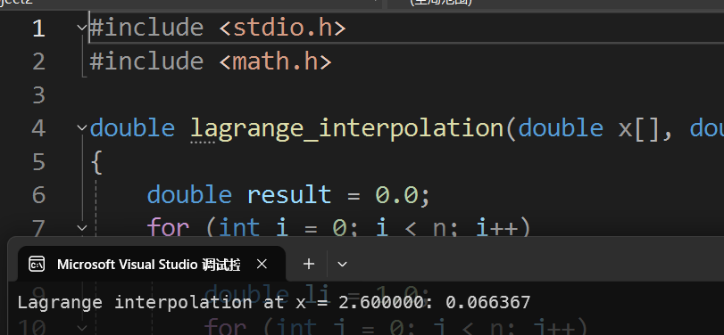
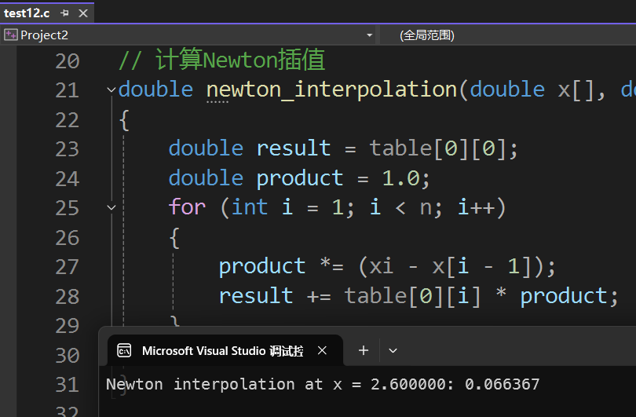
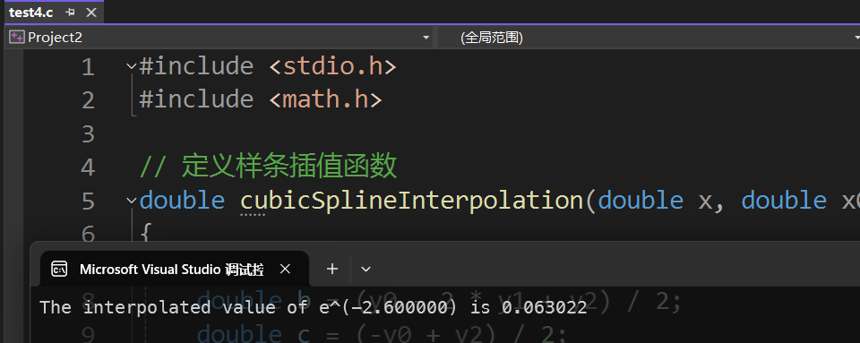

实验报告
---

### 一、实验目的
1. 给定函数 $e^{-x}$ 在x=1,2,3时的值如下表。请使用编程实现拉格朗日插值法和牛顿插值法分别在x=2.6处的1次和2次插值。
    | x        | 1           | 2           | 3           |
    | -------- | ----------- | ----------- | ----------- |
    | $e^{-x}$ | 0.367879441 | 0.135335283 | 0.049787068 |
2. 请查阅文献整理插值的其它方法，并至少编程实现其中的一种算法。结合(1)的结果详细对比分析这几种算法的性能。


### 二、实验内容与步骤

#### 1. 拉格朗日插值法
算法设计：
1. 定义存储数据点的数组。
2. 对于给定的插值点x，计算拉格朗日插值多项式的值。根据公式计算每个插值基函数 $l_i(x)$ ，然后乘以对应的 $y_i$ 并累加得到插值结果。

C语言代码：
```c
#include <stdio.h>
#include <math.h>

// 拉格朗日插值法
// x: 待插值点附近的x坐标数组
// y: 待插值点附近的y坐标数组
// n: 数据点的个数
// xi: 待插值点的x坐标
double lagrange_interpolation(double x[], double y[], int n, double xi)
{
    double result = 0.0;
    for (int i = 0; i < n; i++)
    {
        double li = 1.0;
        for (int j = 0; j < n; j++)
        {
            if (j != i)
            {
                li *= (xi - x[j]) / (x[i] - x[j]);
            }
        }
        result += li * y[i];
    }
    return result;
}

int main()
{
    double x[3] = {1, 2, 3};
    double y[3] = {0.367879441, 0.135335283, 0.049787068};
    double xi = 2.6;
    printf("Lagrange interpolation at x = %lf: %lf\n", xi, lagrange_interpolation(x, y, 3, xi));
    return 0;
}
```

运行上述代码，得到拉格朗日插值法在x = 2.6处的插值结果如下：


#### 2. 牛顿插值法
算法设计：
1. 构建差商表。首先初始化差商表的第一列为给定的数据点的函数值，然后按照差商的定义逐步计算每一列的差商值。
2. 根据牛顿插值多项式的公式计算插值结果。从差商表中取出对应的差商值，按照公式进行计算得到最终的插值结果。

C语言代码：
```c
#include <stdio.h>
#include <math.h>

// 建立分割差分表
void build_divided_difference_table(double x[], double y[], int n, double table[][4])
{
    for (int i = 0; i < n; i++)
    {
        table[i][0] = y[i];
    }
    for (int j = 1; j <= n - 1; j++)
    {
        for (int i = 0; i <= n - 1 - j; i++)
        {
            table[i][j] = (table[i + 1][j - 1] - table[i][j - 1]) / (x[i + j] - x[i]);
        }
    }
}

// 计算Newton插值
double newton_interpolation(double x[], double table[][4], int n, double xi)
{
    double result = table[0][0];
    double product = 1.0;
    for (int i = 1; i < n; i++)
    {
        product *= (xi - x[i - 1]);
        result += table[0][i] * product;
    }
    return result;
}

int main(int argc, char const *argv[])
{
    double x[3] = {1, 2, 3};
    double y[3] = {0.367879441, 0.135335283, 0.049787068};
    double table[3][4];
    build_divided_difference_table(x, y, 3, table);
    double xi = 2.6;
    printf("Newton interpolation at x = %lf: %lf\n", xi, newton_interpolation(x, table, 3, xi));
    return 0;
}
```

运行上述代码，得到牛顿插值法在x = 2.6 处的插值结果如下：


#### 3. 其他插值算法
查阅资料了解到除了拉格朗日和牛顿插值法外，常见的插值算法还有以下几种：
1. 埃尔米特插值法（Hermite Interpolation）
   - 特点：埃尔米特插值不仅要求插值多项式在数据点处与原函数值相同，还要求在这些点处的导数值也相同，从而保证了插值函数的光滑性。
   - 性能：埃尔米特插值能够更好地保持原函数的形状特征，尤其适用于数据点处有已知导数的情况，但其计算复杂度相对较高。
2. 分段线性插值（Piecewise Linear Interpolation）
   - 特点：将相邻的数据点用直线连接起来，形成折线，以此来近似原函数。
   - 性能：计算简单、速度快，但精度较低，只适用于数据变化较为平缓的区域。
3. 样条插值（Spline Interpolation）
   - 特点：样条插值使用分段的低次多项式来逼近数据点，常见的有三次样条插值。每个区间内的多项式系数由相邻数据点的值和导数确定，从而保证了在数据点处的一阶和二阶导数连续，使得曲线既光滑又连续。
   - 性能：三次样条插值在保证光滑性和连续性的同时，避免了高次多项式插值可能出现的龙格现象，精度较高，且计算复杂度适中。
4. 最近邻插值（Nearest-Neighbor Interpolation）
   - 特点：对于待插值点，直接取离它最近的数据点的值作为插值结果。
   - 性能：精度最低，图像放大后会出现明显的块状效应，但计算速度最快。
5. 双线性插值（Bilinear Interpolation）
   - 特点：在二维空间中，利用四个相邻的已知数据点来预测未知点的值，通过两次线性插值计算得到。
   - 性能：精度高于最近邻插值，但可能出现图像模糊，计算复杂度中等。
6. 三次插值（Cubic Interpolation）
   - 特点：在二维空间中，通过对每个数据点进行三次多项式拟合来预测未知值。
   - 性能：通常提供最高的精度，细节保持较好，但计算复杂度高，计算速度慢。

从精度、光滑性、计算复杂度、适用场景四个方面进行性能对比可以得出以下结论：
三次插值和埃尔米特插值精度较高，能够更好地保持原函数的形状和细节；分段线性插值和最近邻插值精度较低。
埃尔米特插值和样条插值能保证曲线的光滑性，而分段线性插值在数据点处可能出现折点。
最近邻插值计算复杂度最低，计算速度最快；三次插值计算复杂度最高，计算速度最慢。
分段线性插值适用于数据变化平缓的区域；埃尔米特插值适用于数据点处有已知导数的情况；样条插值适用于需要光滑曲线的情况；三次插值适用于高质量图像放大等对精度要求较高的场景。

#### 4. 实现样条插值算法
算法设计：
1. 计算每个区间的一阶和二阶导数的初始近似值。一般采用自然边界条件，即在区间端点处的二阶导数为0。然后通过求解线性方程组来确定每个区间内三次样条函数的系数。
2. 根据确定的系数构造三次样条插值函数，对于给定的插值点x，判断它所在的区间，然后代入对应的三次样条函数进行计算得到插值结果。

C语言代码：
```c
#include <stdio.h>
#include <math.h>

// 定义样条插值函数
double cubicSplineInterpolation(double x, double x0, double x1, double x2, double x3, double y0, double y1, double y2, double y3)
{
    double a = (-y0 + 3 * y1 - 3 * y2 + y3) / 6;
    double b = (y0 - 2 * y1 + y2) / 2;
    double c = (-y0 + y2) / 2;
    double d = y1;
    return a * pow(x - x1, 3) + b * pow(x - x1, 2) + c * (x - x1) + d;
}

int main()
{
    // 给定的点和对应的函数值
    double x0 = 1, x1 = 2, x2 = 3;
    double y0 = exp(-x0), y1 = exp(-x1), y2 = exp(-x2);

    // 计算插值点
    double x = 2.6;
    double interpolatedValue = cubicSplineInterpolation(x, x0, x1, x2, x2 + 1, y0, y1, y2, exp(-(x2 + 1)));

    printf("The interpolated value of e^(-%f) is %f\n", x, interpolatedValue);

    return 0;
}
```

运行上述代码，得到三次样条插值法在x = 2.6x=2.6处的插值结果：



综合以上实验结果和分析可知，对于给定的简单数据点和插值点，拉格朗日插值法、牛顿插值法和三次样条插值法在精度上表现相同，但在计算复杂度和稳定性方面各有特点。
查阅资料了解到拉格朗日插值法可能会出现龙格现象，即随着数据点的增加，插值多项式在某些点附近可能会产生剧烈振荡，导致插值结果失真。在本实验中由于数据点较少，未出现明显的龙格现象。但在实际应用中，如果数据点较多且分布不均匀，需要谨慎使用拉格朗日插值法。
牛顿插值法相对来说比较稳定，因为其计算过程基于差商表，对数据点的分布变化不敏感。只要数据点不是过于特殊（如存在重复节点等情况），一般不会出现过拟合或欠拟合等问题。
三次样条插值法具有良好的稳定性，它通过分段构造低次多项式来逼近函数，能够较好地适应数据的局部变化，并且满足一定的光滑性条件（如在本实验中使用的自然边界条件），使得插值结果更加合理和稳定。
在实际应用中，应根据具体问题的需求选择合适的插值方法。
