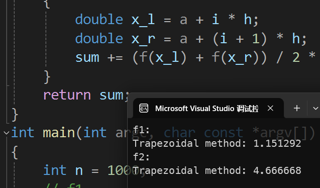

实验报告
---

### 一、实验目的
1. 编写用矩形法、梯形法和辛普森法求解定积分 $\int_0^3\frac x{1+x^2}dx\quad\text{和}\quad\int_0^21+x^2dx$ 并对三种算法的运行结果进行定性和定量的分析。
2. 请查阅文献整理求数值积分的其它方法，并至少编程实现其中的一种算法。结合（1）的结果对比分析几种算法的性能。
3. 请查阅文献整理求数值微分的其它方法，并至少编程实现其中的一种算法。


### 二、实验内容与步骤

#### 1. 矩形法
矩形法是一种计算定积分近似值的方法，其思想是求若干个矩形的面积之和，这些矩形的高由函数值来决定。将积分区间 [a, b] 划分为n个长度相等的子区间，每个子区间的长度为 (a-b)/n 。这些矩形左上角、右上角或顶边中点在被积函数上。这样，这些矩形的面积之和就约等于定积分的近似值。

```c
#include <stdio.h>
#include <math.h>

double f1(double x)
{
    return x / (1 + x * x);
}

double f2(double x)
{
    return 1 + x * x;
}

typedef double (*func)(double);

/**
 * 矩形法
 * @param a 区间左端点
 * @param b 区间右端点
 * @param n 划分的小区间数量
 * @param method 0: 左矩形法 1: 右矩形法
 * @return 积分结果
 */
double rectangle_method(double a, double b, int n, int method, func f)
{
    double h = (b - a) / n;
    double sum = 0.0;
    for (int i = 0; i < n; i++)
    {
        double x_l = a + i * h;
        double x_r = a + (i + 1) * h;
        switch (method)
        {
        case 0:
            sum += f(x_l) * h;
            break;
        case 1:
            sum += f(x_r) * h;
            break;
        default:
            printf("Invalid method!\n");
            return 0;
        }
    }
    return sum;
}

int main(int argc, char const *argv[])
{
    int n = 1000;
    // f1
    printf("f1:\n");
    printf("Rectangle method (left): %lf\n", rectangle_method(0, 3, n, 0, f1));
    printf("Rectangle method (right): %lf\n", rectangle_method(0, 3, n, 1, f1));
    // f2
    printf("f2:\n");
    printf("Rectangle method (left): %lf\n", rectangle_method(0, 2, n, 0, f2));
    printf("Rectangle method (right): %lf\n", rectangle_method(0, 2, n, 1, f2));
    return 0;
}
```
运行结果如下：


#### 2. 梯形法
为了计算出更加准确的定积分，采用梯形代替矩形计算定积分近似值，其思想是求若干个梯形的面积之和，这些梯形的长短边高由函数值来决定。这些梯形左上角和右上角在被积函数上。这样，这些梯形的面积之和就约等于定积分的近似值。

```c
#include <stdio.h>
#include <math.h>

double f1(double x)
{
    return x / (1 + x * x);
}

double f2(double x)
{
    return 1 + x * x;
}

typedef double (*func)(double);

/**
 * 梯形法
 * @param a 区间左端点
 * @param b 区间右端点
 * @param n 划分的小区间数量
 * @return 积分结果
 */
double trapezoidal_method(double a, double b, int n, func f)
{
    double h = (b - a) / n;
    double sum = 0.0;
    for (int i = 0; i < n; i++)
    {
        double x_l = a + i * h;
        double x_r = a + (i + 1) * h;
        sum += (f(x_l) + f(x_r)) / 2 * h;
    }
    return sum;
}
int main(int argc, char const *argv[])
{
    int n = 1000;
    // f1
    printf("f1:\n");
    printf("Trapezoidal method: %lf\n", trapezoidal_method(0, 3, n, f1));
    // f2
    printf("f2:\n");
    printf("Trapezoidal method: %lf\n", trapezoidal_method(0, 2, n, f2));
    return 0;
}
```
运行结果如下：


#### 3. 辛普森法
矩形法和梯形法都是用直线线段拟合函数曲线的方法，另一种形式是采用曲线段拟合函数，实现近似逼近的数值积分方法。辛普森法（Simpson’s rule）是以二次曲线逼近的方式取代矩形或梯形积分公式，以求得定积分的数值近似解。

```c
#include <stdio.h>
#include <math.h>

double f1(double x)
{
    return x / (1 + x * x);
}

double f2(double x)
{
    return 1 + x * x;
}

typedef double (*func)(double);

/**
 * 辛普森法
 * @param a 区间左端点
 * @param b 区间右端点
 * @param n 划分的小区间数量
 * @return 积分结果
 */
double simpson_method(double a, double b, int n, func f)
{
    double h = (b - a) / n;
    double sum = 0.0;
    for (int i = 0; i < n; i++)
    {
        double fa = f(a + i * h);
        double fb = f(a + (i + 1) * h);
        double fm = f(a + (i + 0.5) * h);
        sum += (fa + 4 * fm + fb) * h / 6;
    }
    return sum;
}

int main(int argc, char const *argv[])
{
    int n = 1000;
    // f1
    printf("f1:\n");
    printf("Simpson method: %lf\n", simpson_method(0, 3, n, f1));
    // f2
    printf("f2:\n");
    printf("Simpson method: %lf\n", simpson_method(0, 2, n, f2));
    return 0;
}
```
运行结果如下：


#### 4. 高斯-勒让德积分法
高斯-勒让德积分法是一种基于正交多项式的方法，它通过选择特定的节点和权重来提高积分的精度。对于 nn 点高斯-勒让德积分。


```c
#include <stdio.h>
#include <stdlib.h>
#define _USE_MATH_DEFINES
#include <math.h>

#define TOLERANCE 1e-6

double f1(double x)
{
    return x / (1 + x * x);
}

double f2(double x)
{
    return 1 + x * x;
}

typedef double (*func)(double);

// 计算勒让德多项式 P_n(x)
double legendre_polynomial(int n, double x)
{
    if (n == 0)
        return 1.0;
    if (n == 1)
        return x;

    double p0 = 1.0, p1 = x, pn;
    for (int k = 2; k <= n; k++)
    {
        pn = ((2 * k - 1) * x * p1 - (k - 1) * p0) / k;
        p0 = p1;
        p1 = pn;
    }
    return pn;
}

// 计算勒让德多项式的节点和权重
void legendre_nodes_weights(int n, double *nodes, double *weights)
{
    double x, x0, x1, dx, pn, pnm1, pnm2, pp;
    for (int i = 1; i <= n; i++)
    {
        x = cos(M_PI * (i - 0.25) / (n + 0.5));
        do
        {
            pnm1 = 1.0;
            pnm2 = 0.0;
            for (int j = 1; j <= n; j++)
            {
                pp = pnm1;
                pnm1 = ((2 * j - 1) * x * pnm1 - (j - 1) * pnm2) / j;
                pnm2 = pp;
            }
            dx = pnm1 - x * pnm2;
            x -= pnm1 / dx;
        } while (fabs(dx) > TOLERANCE);
        nodes[i - 1] = x;
        weights[i - 1] = 2.0 / ((1 - x * x) * dx * dx);
    }
}

// 高斯-勒让德积分法
double gauss_legendre(double (*f)(double), double a, double b, int n)
{
    // double nodes[n], weights[n];
    double *nodes = (double *)malloc(n * sizeof(double));
    double *weights = (double *)malloc(n * sizeof(double));
    legendre_nodes_weights(n, nodes, weights);

    double integral = 0.0;
    for (int i = 0; i < n; i++)
    {
        double xi = 0.5 * (b - a) * nodes[i] + 0.5 * (b + a);
        integral += weights[i] * f(xi);
    }
    integral *= 0.5 * (b - a);
    return integral;
}

int main(int argc, char const *argv[])
{
    double eps = 1e-7;
    // f1
    printf("f1:\n");
    printf("Gauss-Legendre method: %lf\n", gauss_legendre(0, 3, eps, f1));
    // f2
    printf("f2:\n");
    printf("Gauss-Legendre method: %lf\n", gauss_legendre(0, 2, eps, f2));
    return 0;
}
```
运行结果如下：


将高斯-勒让德积分法与前面的矩形法、梯形法和辛普森法进行对比，可以发现高斯-勒让德积分法在相同的节点数量下通常能提供更高的精度。然而，它的实现相对复杂，需要额外的计算来确定节点和权重。在实际应用中，应根据具体问题的特点和需求选择合适的数值积分方法。

#### 5. 中心差分法求数值微分
中心差分法是一种常用的数值微分方法，它利用函数在某点两侧的值来近似该点的导数。

```c
#include <stdio.h>
#include <math.h>

double f1(double x)
{
    return x / (1 + x * x);
}

double f2(double x)
{
    return 1 + x * x;
}

typedef double (*func)(double);

double central_difference(double x, double h, func f)
{
    return (f(x + h) - f(x - h)) / (2 * h);
}

int main(int argc, char const *argv[])
{
    double x = 1.0;
    double h = 1e-6;
    printf("f1'(1.0) = %.6f\n", central_difference(x, h, f1));
    printf("f2'(1.0) = %.6f\n", central_difference(x, h, f2));
    return 0;
}
```
运行结果如下：


中心差分法在大多数情况下能提供较为准确的导数近似值。然而，当 hh 选择过大或过小时，可能会引入较大的误差。因此，在实际使用中需要仔细选择步长 hh。此外，对于噪声较大的数据或非光滑函数，中心差分法可能不是最佳选择，此时可以考虑使用其他更稳健的数值微分方法。

### 三、实验总结
本实验通过编程实现了多种数值积分和微分方法，并对其性能进行了比较分析。结果表明，不同的数值方法在不同的应用场景下各有优劣。在实际应用中，应根据具体问题的特点和需求选择合适的数值方法，以达到最佳的计算效果。同时，也应注意数值方法的局限性和可能引入的误差，以便采取相应的措施进行改进和优化。
