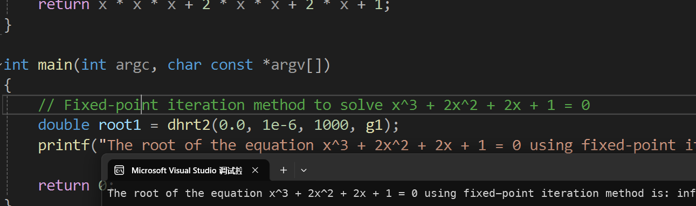
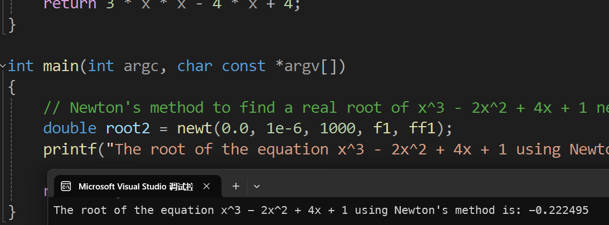
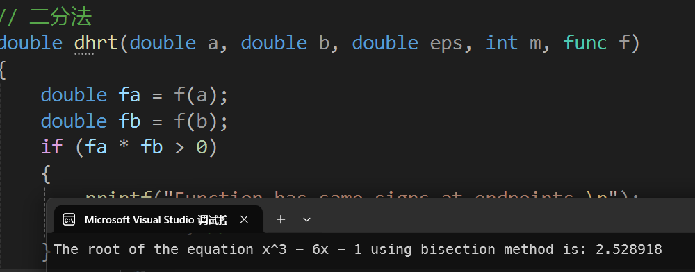
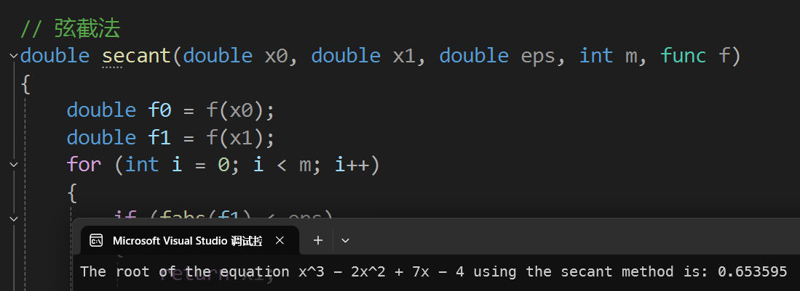
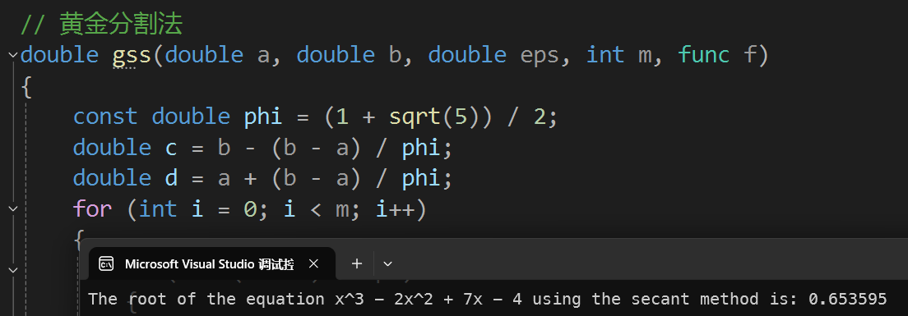

实验报告
---

### 一、实验目的
1. 不动点迭代法求解 $x^3 + 2x^2 + 2x + 1 = 0$
2. 牛顿迭代法求解 $x^3 - 2x^2 + 4x + 1 = 0$ 在 $x = 0$ 附近的一个实
3. 二分法求解 $x^3 - 6x - 1 = 0$ 在 $x = 2$ 附近的一个实根
4. 弦截法求解 $x^3 - 2x^2 + 7x - 4 = 0$ 的一个实根，要求误差不超
5. 黄金分割法求解 $f(x) = x^2 - 4x + 4$ 在 $[0, 4]$ 之间的最小值

### 二、实验内容与步骤

#### 1. 不动点迭代法求解 $x^3 + 2x^2 + 2x + 1 = 0$
```c
#include <stdio.h>
#include <math.h>

typedef double (*func)(double);

// 不动点迭代法
double dhrt2(double x0, double eps, int m, func g)
{
    double x = x0;
    for (int i = 0; i < m; i++)
    {
        double x_next = g(x);
        if (fabs(x_next - x) < eps)
        {
            return x_next;
        }
        x = x_next;
    }
    return x;
}

// x^3 + 2x^2 + 2x + 1 = 0
double g1(double x)
{
    return x * x * x + 2 * x * x + 2 * x + 1;
}

int main(int argc, char const *argv[])
{
    // Fixed-point iteration method to solve x^3 + 2x^2 + 2x + 1 = 0
    double root1 = dhrt2(0.0, 1e-6, 1000, g1);
    printf("The root of the equation x^3 + 2x^2 + 2x + 1 = 0 using fixed-point iteration method is: %f\n", root1);

    return 0;
}
```


#### 2. 牛顿迭代法求解 $x^3 - 2x^2 + 4x + 1 = 0$ 在 $x = 0$ 附近的一个实
```c
#include <stdio.h>
#include <math.h>

typedef double (*func)(double);

// 牛顿迭代法
double newt(double x0, double eps, int m, func f, func ff)
{
    double x = x0;
    for (int i = 0; i < m; i++)
    {
        double fx = f(x);
        double ffx = ff(x);
        if (fabs(fx) < eps)
        {
            return x;
        }
        x = x - fx / ffx;
    }
    return x;
}

// x^3 - 2x^2 + 4x + 1 = 0
double f1(double x)
{
    return x * x * x - 2 * x * x + 4 * x + 1;
}

double ff1(double x)
{
    return 3 * x * x - 4 * x + 4;
}

int main(int argc, char const *argv[])
{
    // Newton's method to find a real root of x^3 - 2x^2 + 4x + 1 near x = 0
    double root2 = newt(0.0, 1e-6, 1000, f1, ff1);
    printf("The root of the equation x^3 - 2x^2 + 4x + 1 using Newton's method is: %f\n", root2);

    return 0;
}
```


#### 3. 二分法求解 $x^3 - 6x - 1 = 0$ 在 $x = 2$ 附近的一个实根
```c
#include <stdio.h>
#include <math.h>

typedef double (*func)(double);

// 二分法
double dhrt(double a, double b, double eps, int m, func f)
{
    double fa = f(a);
    double fb = f(b);
    if (fa * fb > 0)
    {
        printf("Function has same signs at endpoints.\n");
        return -1; // Error value
    }
    for (int i = 0; i < m; i++)
    {
        double c = (a + b) / 2;
        double fc = f(c);
        if (fabs(fc) < eps || (b - a) / 2 < eps)
        {
            return c;
        }
        if (fa * fc < 0)
        {
            b = c;
            fb = fc;
        }
        else
        {
            a = c;
            fa = fc;
        }
    }
    return (a + b) / 2;
}

// x^3 - 6x - 1 = 0
double f2(double x)
{
    return x * x * x - 6 * x - 1;
}
int main(int argc, char const *argv[])
{
    // Bisection method to find a real root of x^3 - 6x - 1 near x = 2
    double root3 = dhrt(1.0, 3.0, 1e-6, 1000, f2);
    printf("The root of the equation x^3 - 6x - 1 using bisection method is: %f\n", root3);

    return 0;
}
```


#### 4. 弦截法求解 $x^3 - 2x^2 + 7x - 4 = 0$ 的一个实根，要求误差不超
```c
#include <stdio.h>
#include <math.h>

typedef double (*func)(double);

// 弦截法
double secant(double x0, double x1, double eps, int m, func f)
{
    double f0 = f(x0);
    double f1 = f(x1);
    for (int i = 0; i < m; i++)
    {
        if (fabs(f1) < eps)
        {
            return x1;
        }
        double x2 = x1 - f1 * (x1 - x0) / (f1 - f0);
        x0 = x1;
        f0 = f1;
        x1 = x2;
        f1 = f(x1);
    }
    return x1;
}

// x^3 - 2x^2 + 7x - 4 = 0
double f3(double x)
{
    return x * x * x - 2 * x * x + 7 * x - 4;
}

int main(int argc, char const *argv[])
{
    // Secant method to find a real root of x^3 - 2x^2 + 7x - 4 with an error not exceeding 10^-6
    double root4 = secant(0.0, 1.0, 1e-6, 1000, f3);
    printf("The root of the equation x^3 - 2x^2 + 7x - 4 using the secant method is: %f\n", root4);

    return 0;
}
```


#### 5. 黄金分割法求解 $f(x) = x^2 - 4x + 4$ 在 $[0, 4]$ 之间的最小值
```c
#include <stdio.h>
#include <math.h>

typedef double (*func)(double);

// 黄金分割法
double gss(double a, double b, double eps, int m, func f)
{
    const double phi = (1 + sqrt(5)) / 2;
    double c = b - (b - a) / phi;
    double d = a + (b - a) / phi;
    for (int i = 0; i < m; i++)
    {
        if (fabs(b - a) < eps)
        {
            return (b + a) / 2;
        }
        if (f(c) < f(d))
        {
            b = d;
        }
        else
        {
            a = c;
        }
        c = b - (b - a) / phi;
        d = a + (b - a) / phi;
    }
    return (b + a) / 2;
}

// f(x) = x^2 - 4x + 4
double f4(double x)
{
    return x * x - 4 * x + 4;
}

int main(int argc, char const *argv[])
{
    // Golden section search method to find the minimum value of f(x) = x^2 - 4x + 4 in the interval [0, 4]
    double min_val = gss(0.0, 4.0, 1e-6, 1000, f4);
    printf("The minimum value of the function f(x) = x^2 - 4x + 4 in the interval [0, 4] using golden section search method is: %f\n", min_val);

    return 0;
}
```

